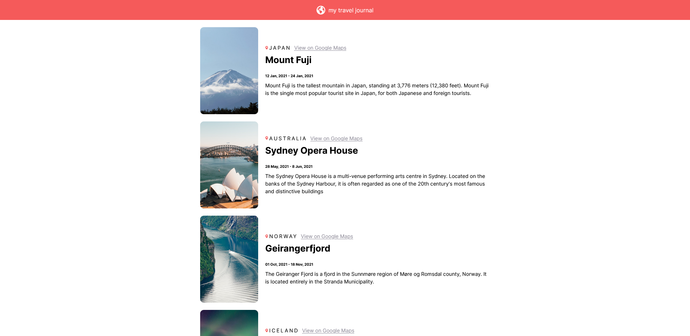

# My React Travel Log

## Table of contents

- [Overview](#overview)
  - [Links](#links)
- [My process](#my-process)
  - [Built with](#built-with)
  - [What I learned](#what-i-learned)
  - [Useful resources](#useful-resources)
- [Author](#author)
- [Acknowledgments](#acknowledgments)

## Overview

### Links

- Live Site URL: [GitHub Page](https://pizpit.github.io/react-travel-log/)

## My process

### Built with

- React
- This project was bootstrapped with create-react-app.
- Semantic HTML5 markup
- CSS custom properties
- Flexbox

### What I learned

I mainly learned how to fully deploy and host a website on GitHub Pages. Most of the HTML and CSS was review but I learned how to fully deploy with create-react-app.

### Useful resources

- [Create React App](https://github.com/facebook/create-react-app) - This helped me structure and make a React app.
- [GitHub Pages](https://pages.github.com/) - This website taught me how to publish my repo as a live website.
- [Create React App Docs](https://create-react-app.dev/docs/deployment#github-pages) - This helped me deploy on GitHub Pages.

## Author

- Website - [Harold Smith III](https://github.com/Pizpit)

## Acknowledgments

- [Scrimba](Scrimba.com) - Thanks to Scrimba for teaching me the React principles needed to make this project.